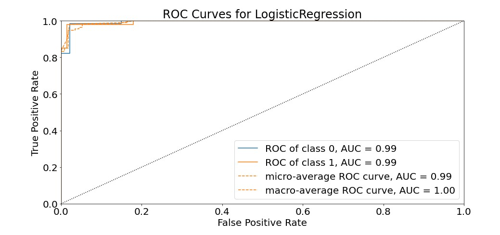

# Dimensionality & Feature Reduction and Feature Engineering

Dimensionality Reduction Dimensionality Reduction is a technique that reduces the number of independent variables to a collection of theory variables by eliminating certain values that are less important in predicting the results. There may be many independent variables, but we have two independent variables at last by applying a suitable dimensionality reduction technique. There are two processes, collection of Feature and Extraction of feature. It is basically used to get two-dimensional data so that a better visualization of machine learning models can be done by plotting the prediction regions.
Below are the steps performed to select top five features for the model.

•	Fetch the required features using RFECV - Recursive Feature Elimination and Cross-Validation Selection
•	With the help of RFECV we can eliminate the irrelevant features based on scoring. 
•	I have used “f1_weighted” for scoring - It results in an F-score that is not between precision and recall

In this project, I have created three classification machine learning models that can predict if a person has breast cancer based on 10 different characteristics of the digitized cell nuclei. In comparison between logistic regression, Keras and SVM, the logistic regression model was more accurate in predicting breast cancer’s class. Therefore, it seems that for classification of breast cancer’s class, logistic regression method is appropriate to be used. The Logistic regression, correctly classifies patients with and without breast cancer 96% of the times. Its AUC of 99% indicates a great ability to distinguish between a benign lump and a malignant tumor.

   <b> Logistic Regression<b>
  
   
  
  
<b> SVM Classifier<b>
   
     
      
  
  
 <b> Keras Classifier <b>
    
  
    

References:
Dua, D. and Graff, C. (2019). UCI Machine Learning Repository [http://archive.ics.uci.edu/ml]. Irvine, CA: University of California, School of Information and Computer Science.
Anand, A. (2020, December 20). Categorical feature selection using chi- squared test. Medium. https://medium.com/analytics-vidhya/categorical-feature-selection-using-chi-squared-test-e4c0d0af6b7e.
Raj, J. T. (2019, March 14). Dimensionality reduction for machine learning. Medium. https://towardsdatascience.com/dimensionality-reduction-for-machine-learning-80a46c2ebb7e.
