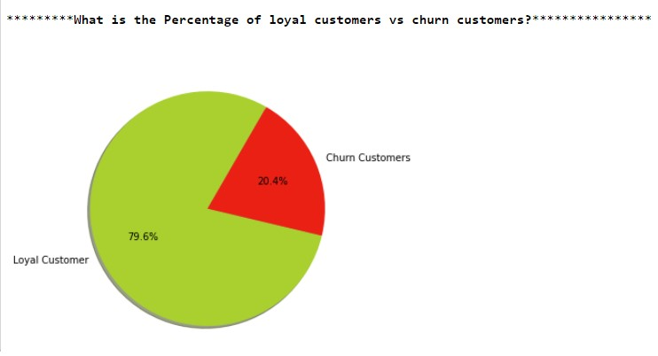

# Customer Churn Prediction in banking
<b>Business Problem </b>  
Customer churn exists across businesses in many sectors, especially since it significantly impacted banking. A company's growth depends on the high acquisition and low attrition rate. A high attrition rate represents a considerable investment loss, and both time and effort need to be channeled into replacing them. Predicting when a client is likely to leave and offering them incentives to stay can offer considerable savings to a business.
Predicting churn (attrition) is essential for any current subscription-based business. A slight fluctuation in churn can significantly impact the bottom line of any business. Hence it is vital to know- "Is this customer going to leave us within X months?" Yes or No? 

 <b>About Data: </b>  
The data used in this use case to perform EDA and predictive Modeling of customer churn in banking was sourced from Kaggle.
Data Source Urls:
https://www.kaggle.com/mathchi/churn-for-bank-customers
The dataset consists of 10000 observations and 12 variables. 
•	Independent variables contain information about customers. 
•	The dependent variable refers to customer abandonment status.

 
<b>Exploratory Data Analysis:</b>  

 

