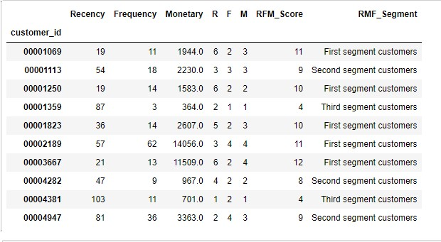
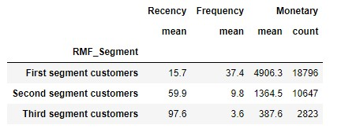
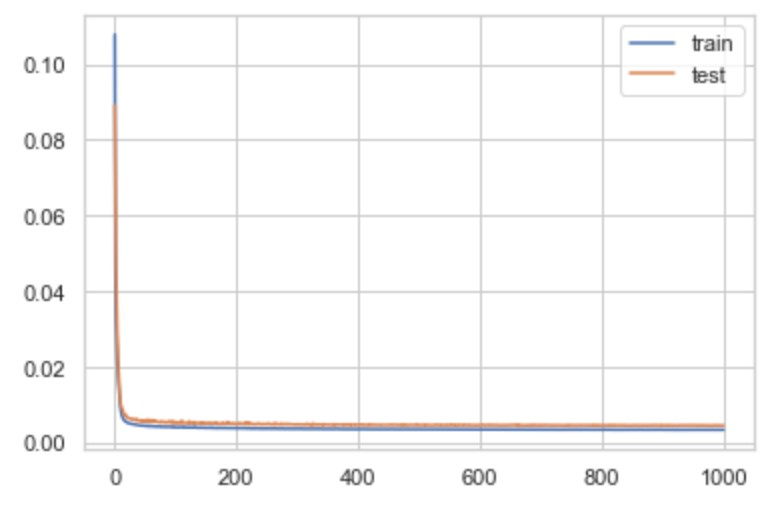

# Customer Purchase Journey Prediction
<b>Business Problem </b>  
Customer purchasing predictions are standard for many companies, including large and small-scale businesses. It is always an advantage to an organization that contains data wealth, and this will help them predict the possible purchasing behavior of a given customer. And it also allows clients to make informed decisions on maintaining inventory and providing customer recommendations on items, customer promotions, and predicting the customer's interests in buying a similar product from its competitor. In this case study, I would analyze and demonstrate some of these metrics on a publicly available dataset and develop an ML model using RNN to predict the future long-term purchasing in the form of customer lifetime values.
 <b>About Data: </b>  
The Ta Feng Grocery Dataset 
Column definition: Transaction date and time, Customer ID, Age Group, PIN Code (Region), Product subclass, Product ID, Amount, Asset, Sales price 
Fields of the Dataset are: 
•	Transaction date and time\
•	Customer ID\
•	Age: 10 possible values\
•	Residence Area: 8 possible values\
•	Product subclass\
•	Product ID\
•	Amount\
•	Asset\
•	Sales price\
 
<b>Exploratory Data Analysis:</b>  
Behavioral customer segmentation is based on three metrics:
•	Recency (R): How many days since customer's last purchase. This model works better for the shorter date range since last purchased.
•	Frequency (F): How many purchases the customer has done 
•	Monetary Value (M):  Measures how much the customer has spent. 
RFM variables are useful for beginning to classify users based on their behavior over time.
 
Impact of RFM scores:
 
EDA 1: RFM Detailed Scores

 
EDA 2: RFM aggregated Scores

Observation: EDA 2 represents RFM scores that are easier to read table summarized by the relative RFM score as shown in EDA 1. The customers with high RFM scores are more important customers to the business. Group customers based on RFM score to classify customers into First Segment, Second Segment, and Third segments for more straightforward interpretation.
•	First Segment customers= RFM Score equal or greater than 9
•	Second Segment customers = RFM Score between 4 and 9
•	Third Segment customers = Anything else
Modeling
In the process of Model creation and evaluation, I just pass all the features that could help to possibly inform the prediction along with split values of Customer ID and R, M, F values. These values are passed into a function that splits the Customer IDs into separate integer values, just in case there truly are features within the Customer ID that can inform RFM prediction.
 <b>Model Stats: </b>

Epoch 996/1000\
32/32 [==============================] - 0s 2ms/step - loss: 0.0035 - mae: 0.0202 - acc: 0.7266 - val_loss: 0.0046 - val_mae: 0.0233 - val_acc: 0.7889\
Epoch 997/1000\
32/32 [==============================] - 0s 2ms/step - loss: 0.0036 - mae: 0.0208 - acc: 0.7165 - val_loss: 0.0047 - val_mae: 0.0227 - val_acc: 0.8807\
Epoch 998/1000\
32/32 [==============================] - 0s 2ms/step - loss: 0.0035 - mae: 0.0201 - acc: 0.7181 - val_loss: 0.0047 - val_mae: 0.0227 - val_acc: 0.9275\
Epoch 999/1000\
32/32 [==============================] - 0s 2ms/step - loss: 0.0036 - mae: 0.0208 - acc: 0.7207 - val_loss: 0.0047 - val_mae: 0.0234 - val_acc: 0.8170\
Epoch 1000/1000\
32/32 [==============================] - 0s 2ms/step - loss: 0.0035 - mae: 0.0205 - <b>acc: 0.7224 </b> - val_loss: 0.0047 - val_mae: 0.0241 - val_acc: 0.6783\
The results show an overall accuracy of 72%. Accuracy of the model is consistently above 70%.

<b>Data Source Urls </b>:
•	https://www.kaggle.com/chiranjivdas09/ta-feng-grocery-dataset
