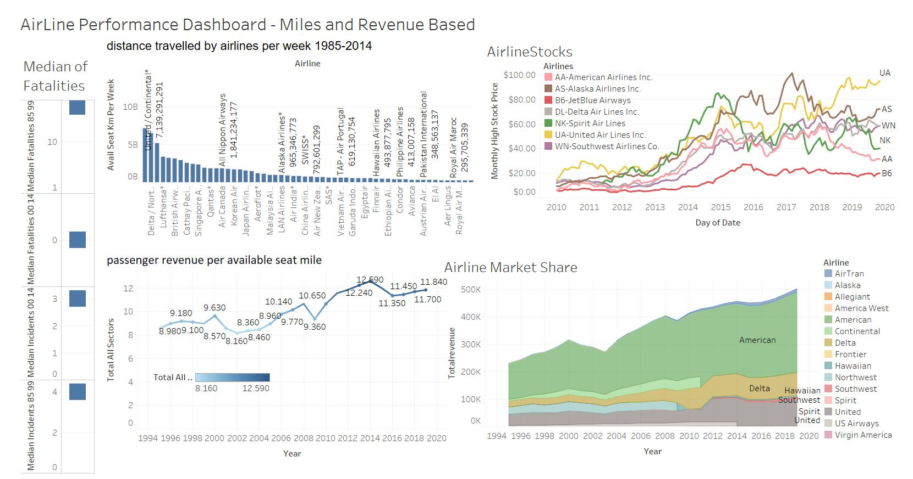
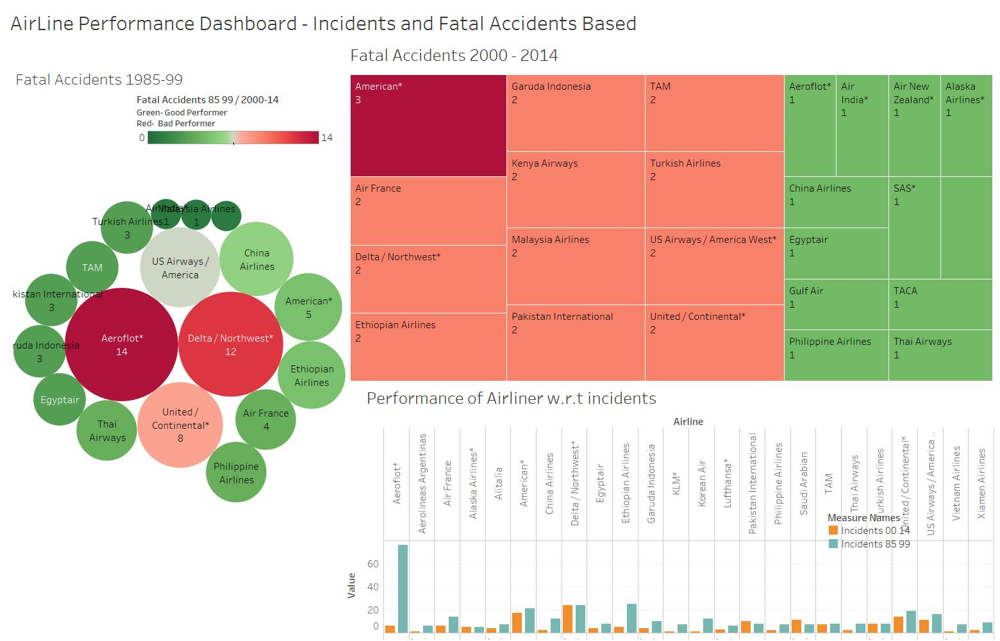
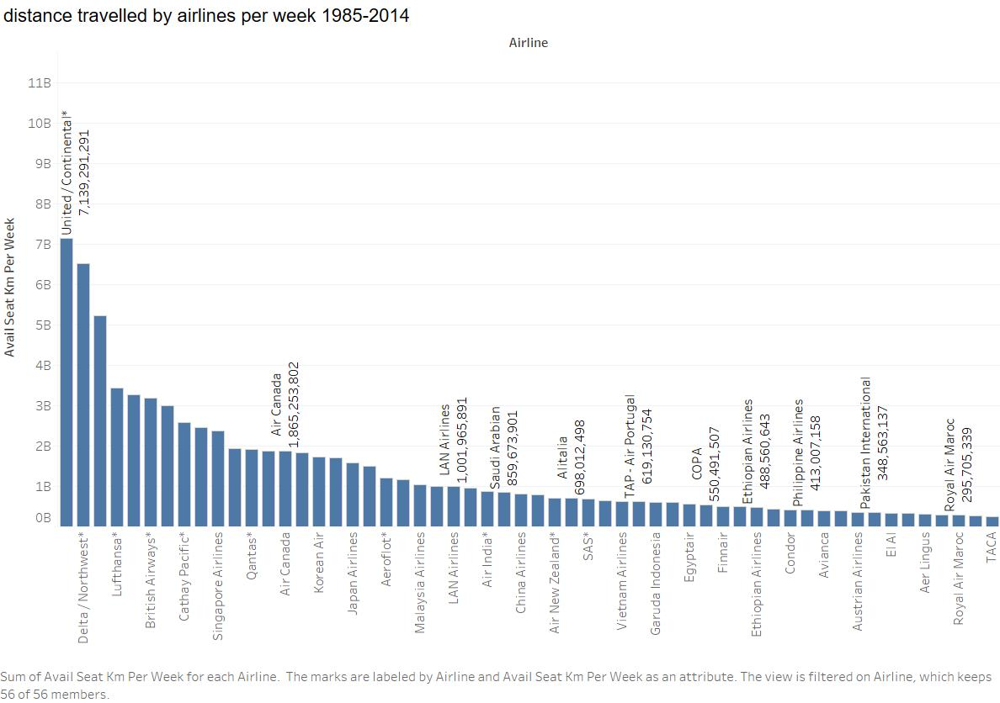

## Airline Performance Dashboard

The main goal of the dashboard is to answer the below questions
1.	Which airline impacted due to Fatalities? Is that airline safe to travel now?
2.	Compare the miles traveled among airlines and conclude most busy airlines and that is safe to travel.
3.	Compare the market revenue share among airlines and conclude that if it safe to travel with modern infrastructure

## Dashboard1: AirLine's Performance Dashboard - Miles and Revenue Based
 
I have used the passenger revenue per available seat mile (PRASM) from 1995 to 2018 to determine a positive trend even though there were fatalities in air travel over the last decade. The dashboard indicates that the revenue growth is significantly low from 1995 to 2005 due to emerging infrastructure and a high rate of fatalities. Due to airline infrastructure advancements, we can see revenue growth from 2005 to 2018. 
Note: In Dashboard 2, I have demonstrated the analysis of a spike in fatalities during this period.

United/Continental airlines, followed by Delta, are the busiest airlines, but on the contrary American airlines is top in revenue market share of 244k, followed by United (88K) and Delta (80K). 
 
I took the median of fatalities for the period 1985-1999 and 2000-2014. It indicates that 
The median of fatalities is 48.5 in the period 1985-1999 and 0 in the period 2000-2014, and Median of Incidents have been reduced in 2000-2014 compared to period 1985-1999. It signifies that it is safe to travel in a modern-day world with much-improved infrastructure.
 
 
 
## Dashboard 2: Airline Performance Dashboard - Incidents and Fatal Accidents Based
 
The first metric is to compare Fatal Accidents of airlines in a set of 2000- 2014 and
1985-1999 is to determine the safeness of air travel. To visualize, I have used a heatmap and packed bubble chart to identify the lousy performer Airline that has more Accidents in a period 15 year period. From Accidents, Fatalities and Incidents Comparison, we can clearly distinguish that fatalities and incidents are comparatively minor for the year 2000- 2014 compared to 1985-1999.
Aeroflot is considered a bad performer from 1985 to 1999, followed by American in years 200-14. But if we compare the fatal incidents between the decades, Aeroflot contributed 14 fatal accidents, and it is still contributing. Hence it is not safe to travel via Aeroflot. The final chart compares the incidents occurred during the decades per airline. I have used color coding to differentiate the decade metric in bar graph.

 

I have calculated the median of fatalities. It indicates that with a distribution and median that is significantly low for 2000-2014 when compared to 1985-99, it is clear that flying in the modern period produces fewer fatalities than the prior period. It shows that in all three safety metrics (Incidents, Fatal Accidents, and Fatalities), flying is safer today than at any point in the past.  
As per distance traveled by airlines per week; united airlines, followed by Delta, are the busiest airlines. Aeroflot is unsafe to travel. American Airlines is a luxuries airline and safe to travel.

# Reference:
1.	Airline safety:https://github.com/fivethirtyeight/data/tree/master/airline-safety

2.	Total System Passenger Revenue per ASM: US DOT Form 41 via BTS, schedule T2, . (n.d.). MIT. http://web.mit.edu/airlinedata/www/2019%2012%20Month%20Documents/Traffic%20and%20Capacity/System%20Total/Total%20System%20Passenger%20Revenue%20per%20ASM.htm.

3.	Total System Revenue Passenger Miles: US DOT Form 41 via BTS, schedule T2, N. A. (n.d.). MIT. http://web.mit.edu/airlinedata/www/2019%2012%20Month%20Documents/Traffic%20and%20Capacity/System%20Total/Total%20System%20Revenue%20Passenger%20Miles.htm.

4. Secondary Data source: http://web.mit.edu/airlinedata/www/Traffic&Capacity.html

