# Heart Attack Prediction
<b>Business Problem </b>  
Heart attack is the number 1 cause of death compared to other diseases globally, taking an approximate estimation of 18 million lives each year, accounting for 31% of worldwide deaths. Heart failure can be prevented by addressing behavioral risk factors such as unhealthy diet, tobacco use, obesity (overweight concerns), physical inactivity, and heavy use of alcohol using population-wide strategies. If these risk factors are coupled with early treatment, it dramatically impacts its prognosis.
It is undoubtedly difficult to identify high-risk patients because of several multi-factorial contributory risk factors such as high B.P., diabetes, and high cholesterol. Here comes the need for machine learning and data mining to study, evaluate and predict the disease beforehand.
Medical researchers, doctors, and scientists are still contributing to machine learning (ML) techniques to develop interactive GUIs to predict the early detection of this disease. This is because of their superiority in classification compared to other traditional statistical approaches and pattern recognition. In this use case, I will be addressing below research questions.
 
Research Questions:
•	Can physicians will be able to predict Cardiovascular disease with the help of patient demographics
•	Does this prediction reduce the risk and prevent heart attack disease. Is early detection of heart attack possible?

 <b>About Data: </b>  
The dataset was gathered from the Machine Learning Repository from the Center for Machine Learning and
Intelligent Systems at the University of California, Irvine. This directory contains four datasets concerning heart
failure diagnosis. Features are numeric valued. The databases have 76 raw attributes; only 14 of them are used.
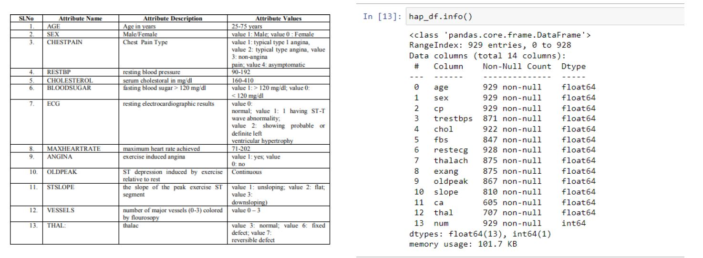
 
<b>Exploratory Data Analysis:</b>  
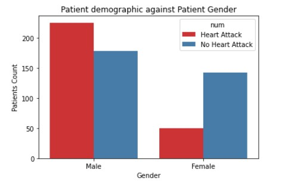

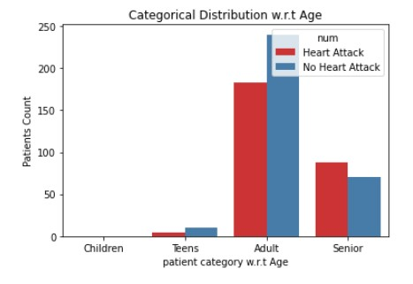

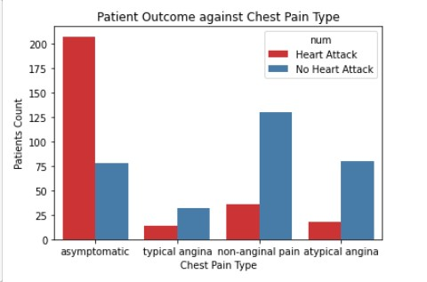

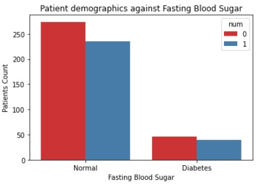

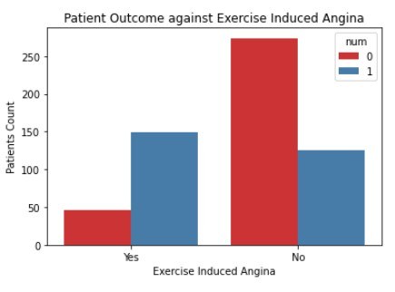

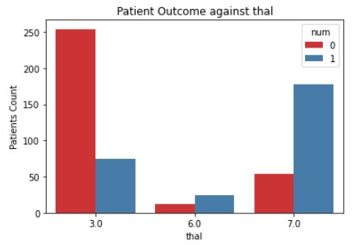

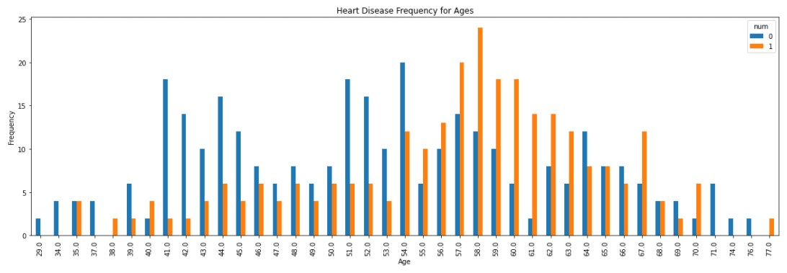
 

 <b> Model Performance </b>  
# Logistic Regression

# SVC
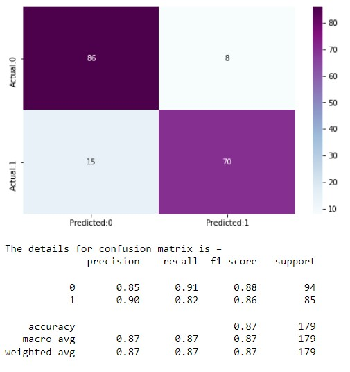

# Decision Tree
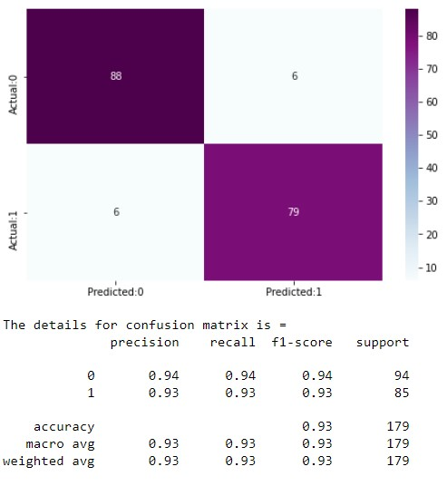

# Random Forest
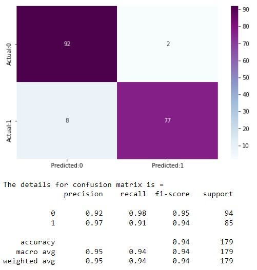

 <b> Model Performance </b>  

# Decision Tree
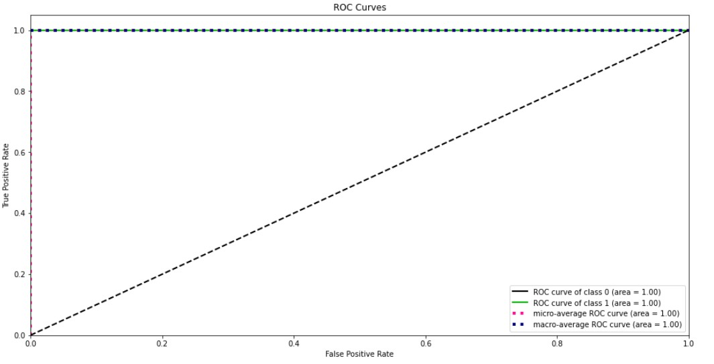

# Logistic Regression
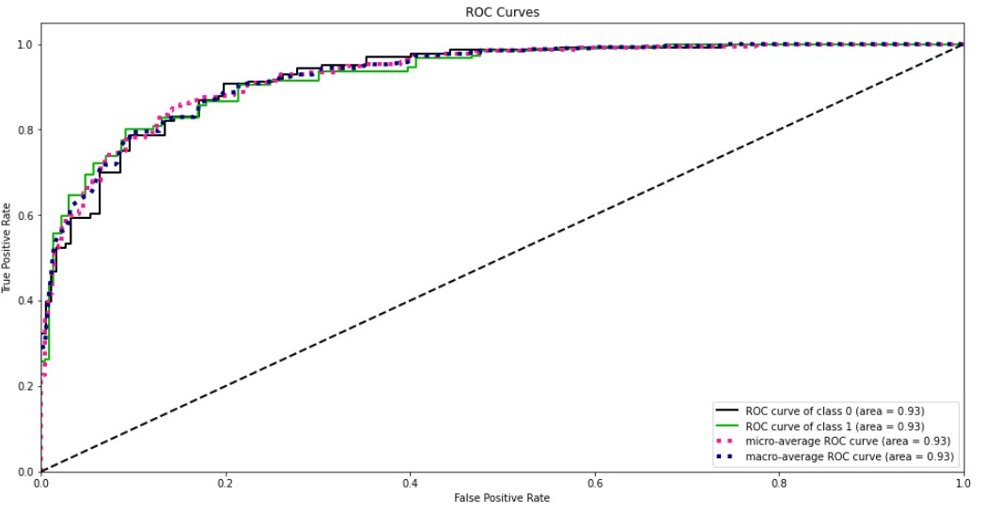

# Random Forest
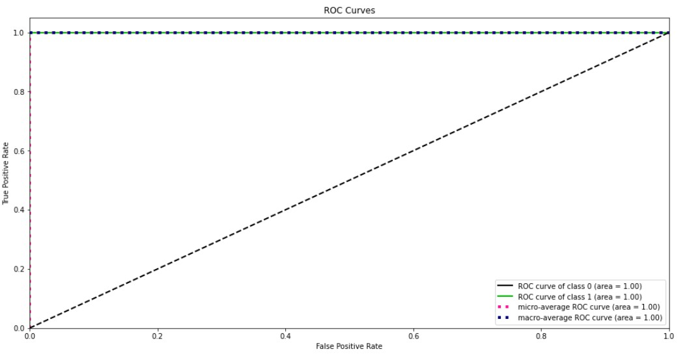

# SVC
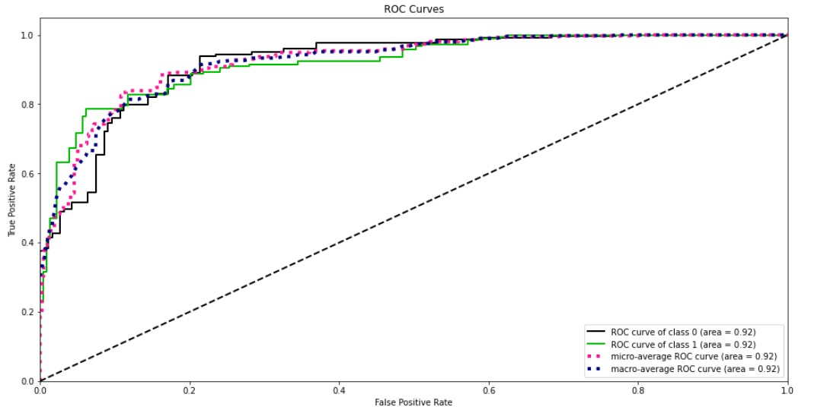

 <b> Model Results </b>  

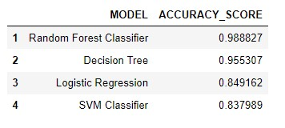
