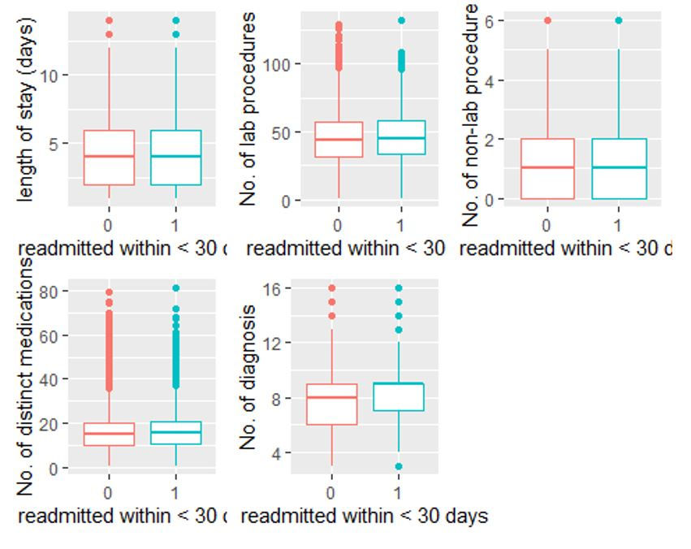
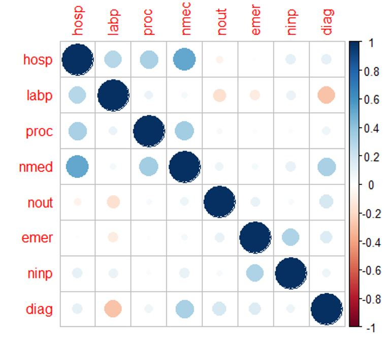

<b>Predicting Hospital Readmission of Diabetic patients</b>

In the project, I build the logistic regression model with LASSCO in classifications to identify best model variables. And I have used the Bayes' rule for model evaluation to pick the best model and set the risk ratio at a01/a10 = 0.1 to consider the loss. Because for patients who are readmitted within 30 days, the hospital won't get paid from the social insurance system. In other words, the cost is more considerable for a false negative prediction. I find that the length of a hospital stay, the frequency of the inpatient visit, and the discharge location are the most important predictors for the readmission status.
Predicting the readmission status for patients with diabetes, the length of stay in the hospital, the number of inpatient visits, and where the patient was discharged after treatment are the most important predictors. Clinical results and medication details may help physicians in the diagnosis in some way. Still, they may provide redundant information we needed for prediction as we already have the health service records. The Key variables are identified as num_procedures, num_medications, number_emergency, number_inpatient, A1Cresult, metformin, glimepiride, insulin, diabetesMed, disch_disp_modified, adm_src_mod, age_mod, diag1_mod, diag2_mod, diag3_mod. The Bayes Rule Classification Threshold using the risk ratio of 2:1 was 1/3. This means that if the predicted probability of readmission exceeds 1/3, we will predict that that individual gets readmitted. Our misclassification error was about 22%. 
<b>Patient Medical History</b> 
   
   
  
  
 

<b>Correlation plot </b>
It appear to be some positive correlations between number of medications and variables like the time spent in hospital, number of procedures, and diagnoses. Next, I’ll look at the categorical variable age, and see if this conforms to my expectation that diabetic patients trend to be older on average.
   
   
 
