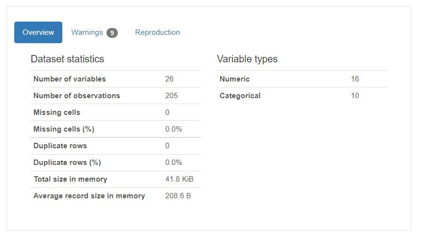
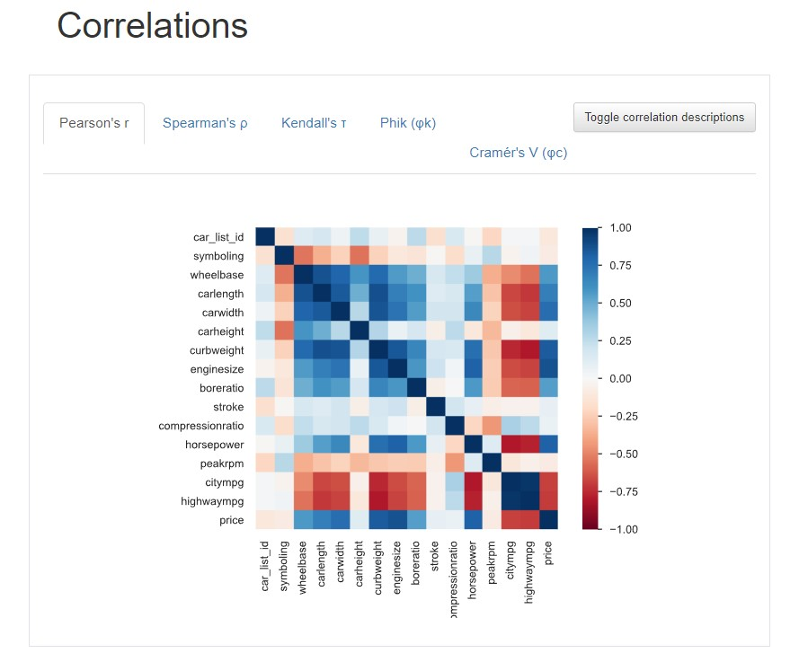

## Data Science Projects Portfolio

# Project 1: Data Preparation - ETL and Data Analysis Project

   <b> Data Preparation - ETL and Data Analysis Project </b> 
           I have considered three datasets for the Data Preparation - ETL Project. The three datasets are linked based on the Make and Model of a given vehicle. 
 <b>Data source 1: flat file</b>
The CSV file containing the vehicle demographics, which is specific to the wheelbase, fuel type, and respective price of several motor vehicle models. Each row is one vehicle model, and each column is one specification such as engine size, fuel system, stroke, horsepower, highway mpg, city mpg, etc. 

 
  
 
 <b>Data Source 2: Website</b>
The Website that contains a table of the number of each vehicle model sold during 2020. Each row is one vehicle model. The website represents the make and model as car models. I split based on the pattern and assigned the values to respective columns to make the data more granular. 
 
             
   

 
 <b>Data Source 3: API</b>
I choose 2 API datasets to support my use case that contains the vehicle catalog and Vehicle mechanical demographics  
    
              
   

 <b>Transformation rules:</b>  
•	extract data from CSV files and perform data cleansing techniques. 
•	renamed few column names to make it more meaningful to understand and deduped the complete dataset. 
•	subjected the data set to pandas_profiling to identify the correlation between variables missing values and outliers in the dataset. 
•	Extract data from HTML sources and perform data parsing techniques using web scrapping python libraries 
•	import the HTML data and get it into a more readable format, such as a data frame using BeautifulSoup 
•	removed redundant data which is not required for my use case. 
•	converted the returned data into JSON format for ease of access. 
•	renamed and dropped a few of the columns which are not required for my use case. 
•	organized the retrieved data into a data frame. 
•	merged two API source data and created a cleansed dataframe with make and model as a grain of the data. 
      
    
 
 <b>Visualizations </b>  
•	Scatter plot of horsepower (flat file) vs. Engine_Capacity (website) 
   
    
 
•	Bar chart of average car Price (API) for each car make (flat file) 
   
    
 
•	Viewing the sales (website) for each make (flat file) as a pie chart 
   
    
 

•	Density plot of duration_listed (flat file) 
   
    
 
• Boxplots of the Highway mpg distribution (flat file) for each car make (flat file) 
   
    
  

# Project 2: Exploratory Analysis on Factors Affecting Vehicular Emissions

I have considered the dataset of Co2 emission from kaggle.

The question i have addressed in this analysis: what vehicle mechanical demographic variables are most correlated with an increase in CO2 emissions?

I also had a few secondary questions I wanted to answer:

• if low end priced cars and high-end premium cars got a variation towards fuel consumption,

• if CVTs are more or less likely to be found on larger engines

In my EDA, I concluded that the most significant factors in increasing a vehicle’s emissions are its variant, engine, and fuel consumption. Cylinder number goes hand-in-hand with displacement, so that is included as well. What surprised me was that transmission and fuel types did not affect emissions as much as said variables. Based on this, I would recommend purchasing a compact, midsize sedan, or station wagon, equipped with a 4-cylinder engine running regular gasoline, to reduce emissions. Such cars are usually very inexpensive, so it’s a win-win situation!

I then plotted a PMF of the fuel consumption of gas and premium gas cars. There was indeed a difference between premium Vehicles had higher fuel consumption vehicles; it made me to to run the hypothesis test to test the difference in means, and the output yielded a p-value significantly smaller than zero, confirming that regular gasoline does, in fact, consume less fuel. It is also much less expensive, so the only reason one should purchase premium gas is if their car requires it.

The box plot of emissions vs car manufacturer. I found that (no surprise) all sports car and most luxury car brands are guilty of emitting more CO2 than other cars. Based on the plot, the following brands have the lowest emissions and are the brands I would recommend purchasing: Fiat, Honda, Hyundai, Mazda, Mini, Smart, and Volkswagen. If one is adamant on buying a luxury car, they should consider Audi or Acura; these brands are in the middle of the emissions spectrum.

After calculating the percentage of CVT transmissions found for all cars with a certain number of cylinders and plotted this against the number of cylinders. The observation I made here is occurrence of CVTs dropped with increasing engine size. Agreed, as CVTs are already very expensive and have issues with higher loads.

# Project 3: { R Project} Predicting Hospital Readmission of Diabetic patients
In the project, I build the logistic regression model with LASSCO in classifications to identify best model variables. And I have used the Bayes' rule for model evaluation to pick the best model and set the risk ratio at a01/a10 = 0.1 to consider the loss. Because for patients who are readmitted within 30 days, the hospital won't get paid from the social insurance system. In other words, the cost is more considerable for a false negative prediction. I find that the length of a hospital stay, the frequency of the inpatient visit, and the discharge location are the most important predictors for the readmission status.

Predicting the readmission status for patients with diabetes, the length of stay in the hospital, the number of inpatient visits, and where the patient was discharged after treatment are the most important predictors. Clinical results and medication details may help physicians in the diagnosis in some way. Still, they may provide redundant information we needed for prediction as we already have the health service records. The Key variables are identified as num_procedures, num_medications, number_emergency, number_inpatient, A1Cresult, metformin, glimepiride, insulin, diabetesMed, disch_disp_modified, adm_src_mod, age_mod, diag1_mod, diag2_mod, diag3_mod. The Bayes Rule Classification Threshold using the risk ratio of 2:1 was 1/3. This means that if the predicted probability of readmission exceeds 1/3, we will predict that that individual gets readmitted. Our misclassification error was about 22%.

# Project 4: Dimensionality & Feature Reduction and Feature Engineering on Breast Cancer Case study
Dimensionality Reduction Dimensionality Reduction is a technique that reduces the number of independent variables to a collection of theory variables by eliminating certain values that are less important in predicting the results. There may be many independent variables, but we have two independent variables at last by applying a suitable dimensionality reduction technique. There are two processes, collection of Feature and Extraction of feature. It is basically used to get two-dimensional data so that a better visualization of machine learning models can be done by plotting the prediction regions. Below are the steps performed to select top five features for the model.

• Fetch the required features using RFECV - Recursive Feature Elimination and Cross-Validation Selection • With the help of RFECV we can eliminate the irrelevant features based on scoring. • I have used “f1_weighted” for scoring - It results in an F-score that is not between precision and recall

In this project, I have created three classification machine learning models that can predict if a person has breast cancer based on 10 different characteristics of the digitized cell nuclei. In comparison between logistic regression, Keras and SVM, the logistic regression model was more accurate in predicting breast cancer’s class. Therefore, it seems that for classification of breast cancer’s class, logistic regression method is appropriate to be used. The Logistic regression, correctly classifies patients with and without breast cancer 96% of the times. Its AUC of 99% indicates a great ability to distinguish between a benign lump and a malignant tumor.

# Project 5: Breast Cancer Prediction - Model evaluation
Compared to logistic regression, Random Forest, KNN, and SVM, the logistic regression model was more accurate in predicting breast cancer's class. It seems that for the classification of breast cancer class, the logistic regression method is appropriate. The Logistic regression correctly classifies patients with and without breast cancer 96% of the time. Its AUC of 99% indicates a remarkable ability to distinguish between a benign lump and a malignant tumor In the Anaconda environment, all algorithms have been programmed in Python using the scikit-learn library. After an accurate comparison between our models, I found that the logistic regression achieved a higher efficiency of 98%, Precision of 97.5%, AUC of 99 %, and outperformed all other algorithms. In conclusion, Logistic regression has demonstrated its efficiency in Breast Cancer prediction and diagnosis and achieves the best performance in terms of accuracy and Precision.

Model           SVM   LogisticRegression  RandomForest  KNN 

Prediction Yes  82    80                  77             81 

Prediction -No  146   148                 151            147

Accuracy        97%   98%                 97%            98%

# Project 6: Airline Performance Dashboard using tableau

* Dashboard1: AirLine's Performance Dashboard - Miles and Revenue Based
I have used the passenger revenue per available seat mile (PRASM) from 1995 to 2018 to determine a positive trend even though there were fatalities in air travel over the last decade. The dashboard indicates that the revenue growth is significantly low from 1995 to 2005 due to emerging infrastructure and a high rate of fatalities. Due to airline infrastructure advancements, we can see revenue growth from 2005 to 2018. Note: In Dashboard 2, I have demonstrated the analysis of a spike in fatalities during this period.

United/Continental airlines, followed by Delta, are the busiest airlines, but on the contrary American airlines is top in revenue market share of 244k, followed by United (88K) and Delta (80K).

I took the median of fatalities for the period 1985-1999 and 2000-2014. It indicates that The median of fatalities is 48.5 in the period 1985-1999 and 0 in the period 2000-2014, and Median of Incidents have been reduced in 2000-2014 compared to period 1985-1999. It signifies that it is safe to travel in a modern-day world with much-improved infrastructure.

* Dashboard 2: Airline Performance Dashboard - Incidents and Fatal Accidents Based
The first metric is to compare Fatal Accidents of airlines in a set of 2000- 2014 and 1985-1999 is to determine the safeness of air travel. To visualize, I have used a heatmap and packed bubble chart to identify the lousy performer Airline that has more Accidents in a period 15 year period. From Accidents, Fatalities and Incidents Comparison, we can clearly distinguish that fatalities and incidents are comparatively minor for the year 2000- 2014 compared to 1985-1999. Aeroflot is considered a bad performer from 1985 to 1999, followed by American in years 200-14. But if we compare the fatal incidents between the decades, Aeroflot contributed 14 fatal accidents, and it is still contributing. Hence it is not safe to travel via Aeroflot. The final chart compares the incidents occurred during the decades per airline. I have used color coding to differentiate the decade metric in bar graph.

I have calculated the median of fatalities. It indicates that with a distribution and median that is significantly low for 2000-2014 when compared to 1985-99, it is clear that flying in the modern period produces fewer fatalities than the prior period. It shows that in all three safety metrics (Incidents, Fatal Accidents, and Fatalities), flying is safer today than at any point in the past.
As per distance traveled by airlines per week; united airlines, followed by Delta, are the busiest airlines. Aeroflot is unsafe to travel. American Airlines is a luxuries airline and safe to travel.

# Project 7: Mini applications using python.

# Project 8

# Project 9

# Project 10

